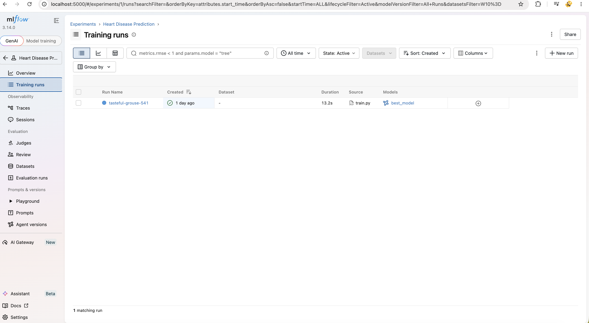
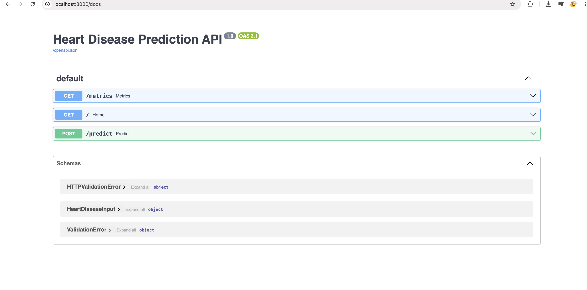
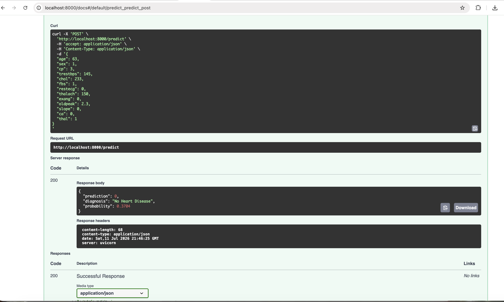
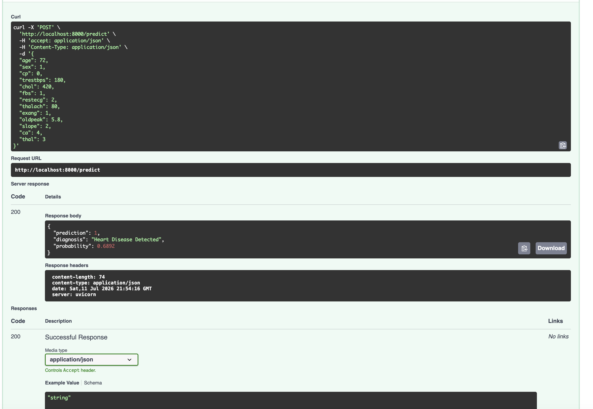
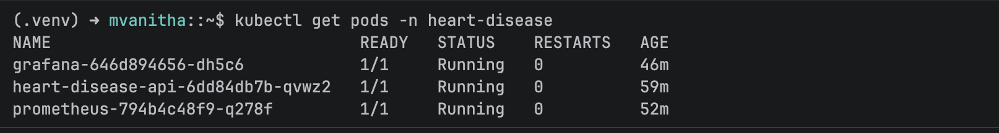
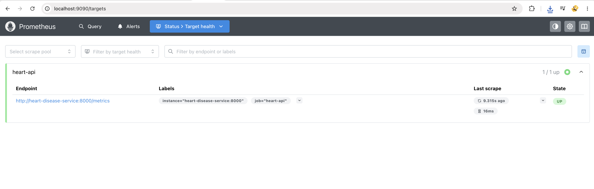
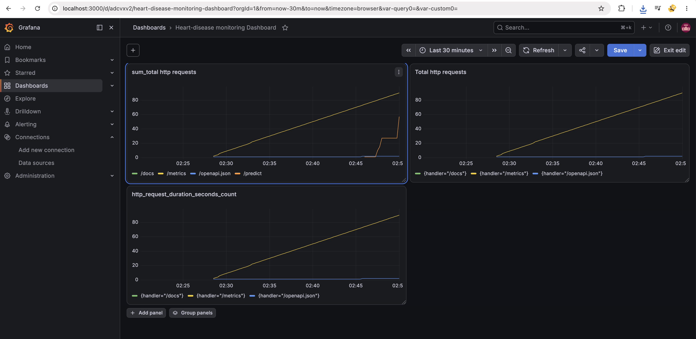

# Heart Disease Prediction – End-to-End MLOps Pipeline

## Overview

## Overview

This project implements an end-to-end MLOps pipeline for predicting heart disease using machine learning.

The workflow includes data preprocessing, model training, experiment tracking with MLflow, API development using FastAPI, containerization with Docker, deployment on Kubernetes (Minikube), and monitoring using Prometheus and Grafana.

The objective was not only to build a prediction model but also to deploy and monitor it using industry-standard MLOps tools. The project covers the complete workflow starting from data preprocessing to Kubernetes deployment and application monitoring.

---

## Project Workflow

```
+-------------------------------------------+
|      UCI Heart Disease Dataset            |
+-------------------------------------------+
                    │
                    ▼
+-------------------------------------------+
|         Data Preprocessing                |
+-------------------------------------------+
                    │
                    ▼
+-------------------------------------------+
|          Model Training                   |
+-------------------------------------------+
                    │
                    ▼
+-------------------------------------------+
|     Hyperparameter Tuning                 |
+-------------------------------------------+
                    │
                    ▼
+-------------------------------------------+
|    MLflow Experiment Tracking             |
+-------------------------------------------+
                    │
                    ▼
+-------------------------------------------+
|        FastAPI REST API                   |
+-------------------------------------------+
                    │
                    ▼
+-------------------------------------------+
|      Docker Containerization              |
+-------------------------------------------+
                    │
                    ▼
+-------------------------------------------+
|   Kubernetes Deployment (Minikube)        |
+-------------------------------------------+
                    │
                    ▼
+-------------------------------------------+
|       Application Logging                 |
+-------------------------------------------+
                    │
                    ▼
+-------------------------------------------+
|      Prometheus Monitoring                |
+-------------------------------------------+
                    │
                    ▼
+-------------------------------------------+
|       Grafana Dashboard                   |
+-------------------------------------------+
                    │
                    ▼
+-------------------------------------------+
|      GitHub Actions (CI)                  |
+-------------------------------------------+
```

---

## Dataset

Dataset: UCI Heart Disease Dataset

- Samples: 303
- Features: 13
- Target:
  - 0 → No Heart Disease
  - 1 → Heart Disease

## Project Structure

```

│
├── api/
│   ├── app.py
│   └── schemas.py
│
├── src/
│   ├── preprocess.py
│   ├── train.py
│   ├── evaluate.py
│
├── data/
│   ├── raw/
│   └── processed/
│
├── models/
│   └── best_model.pkl
│
├── notebooks/
│
├── tests/
│
├── k8s/
│
├── monitoring/
│
├── .github/
│
├── Dockerfile
├── docker-compose.yml
├── requirements.txt
└── README.md
└── images

```

---

## Model Development

Two machine learning models were trained and evaluated.

- Logistic Regression
- Random Forest Classifier

Hyperparameter tuning was performed using GridSearchCV.

### Model Performance

| Model | Accuracy | ROC-AUC |
|--------|----------|----------|
| Logistic Regression | **88.52%** | **0.966** |
| Random Forest | **86.89%** | **0.943** |

Logistic Regression achieved the highest evaluation accuracy (88.52%). A hyperparameter-tuned Random Forest model was also trained using GridSearchCV and selected as the deployment model. The trained pipeline was saved as models/best_model.pkl and served through the FastAPI application

---

## Experiment Tracking

MLflow was used to record every training experiment.

The following information is logged.

- Model parameters
- Hyperparameters
- Evaluation metrics
- Best model

To start MLflow

```bash
mlflow ui
```

Open

```
http://localhost:5000
```
Below is the MLflow dashboard used to track model experiments.



---

## REST API

The trained model is exposed through a FastAPI application.

Start the API

```bash
uvicorn api.app:app --reload
```

Swagger UI

```
http://localhost:8000/docs
```
Swagger UI



Prediction Endpoint

```
POST /predict
```

Metrics Endpoint

```
GET /metrics
```

Example response

```json
{
    "prediction": 1,
    "diagnosis": "Heart Disease Detected",
    "probability": 0.9423
}
```
Prediction Example




---

## Docker

Build the Docker image

```bash
docker build \
-t heart-disease-api:v1.3 \
-t heart-disease-api:latest .
```

Run the container

```bash
docker run -p 8000:8000 heart-disease-api:v1.3
```

---

## Kubernetes Deployment

The Docker image was deployed locally using **Minikube**.

Deployment resources include

- Namespace
- Deployment
- Service

Deploy the application

```bash
kubectl apply -f k8s/
```

Verify deployment

```bash
kubectl get pods -n heart-disease
```


---

## Monitoring

Application monitoring is implemented using **Prometheus** and **Grafana**.

Prometheus continuously collects metrics from the FastAPI application.

Grafana visualizes API metrics through dashboards.

Prometheus

```
http://localhost:9090
```

Grafana

```
http://localhost:3000
```
Prometheus Target



Grafana Dashboard


---

## Logging

Prediction requests are logged using Python's logging module.

Each prediction records:

- Input values
- Prediction result
- Diagnosis
- Probability score

---

## Testing

Unit tests were implemented using **Pytest**.

Run the tests

```bash
pytest -v
```

Current Status

```
3 tests passed
```

---

## Continuous Integration

GitHub Actions is configured to automatically execute the test suite whenever changes are pushed to the repository.

---

## Technologies Used

- Python
- Pandas
- Scikit-learn
- FastAPI
- MLflow
- Docker
- Kubernetes (Minikube)
- Prometheus
- Grafana
- Pytest
- GitHub Actions

---

## Screenshots

The repository includes screenshots for:

- MLflow Experiments
- FastAPI Swagger UI
- Prediction API
- Kubernetes Deployment
- Prometheus Targets
- Grafana Dashboard

---

## Future Improvements

- Deploy on AWS or Azure Kubernetes Service.
- Implement model drift monitoring.

---

## Author

R V Mahendran

## Conclusion

This project demonstrates a complete MLOps workflow starting from model development to deployment and monitoring. It combines machine learning with modern DevOps practices using MLflow, FastAPI, Docker, Kubernetes, Prometheus, Grafana, and GitHub Actions.

## Commands summary

source .venv/bin/activate

python src/train.py or pythom -m src.train

mlflow ui

uvicorn api.app:app --reload

docker images

docker ps

kubectl get ns

kubectl get pods -n heart-disease

kubectl get svc -n heart-disease

kubectl port-forward svc/prometheus 9090:9090 -n heart-disease

kubectl port-forward svc/grafana 3000:3000 -n heart-disease

